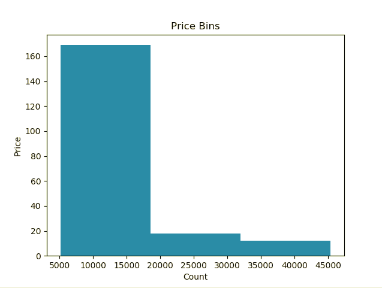
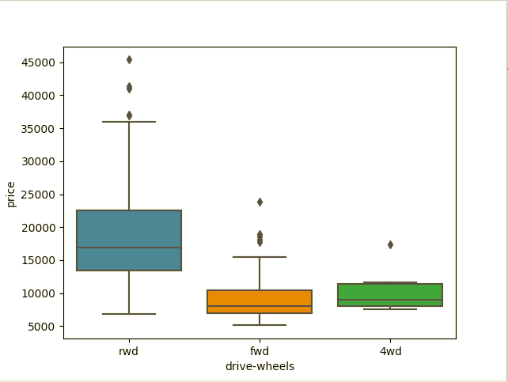
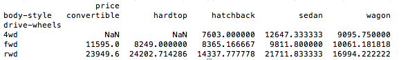
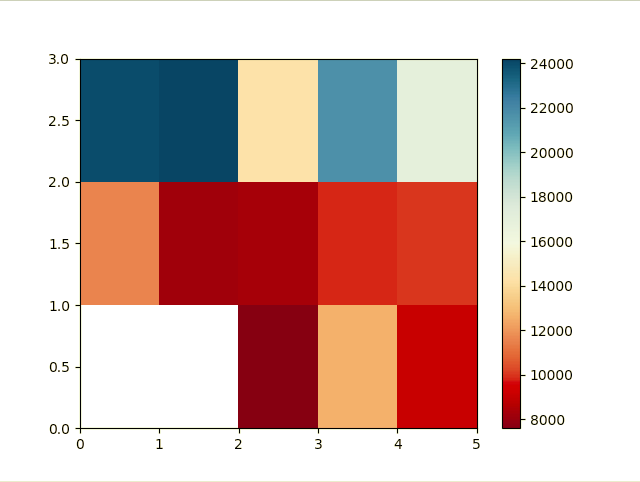
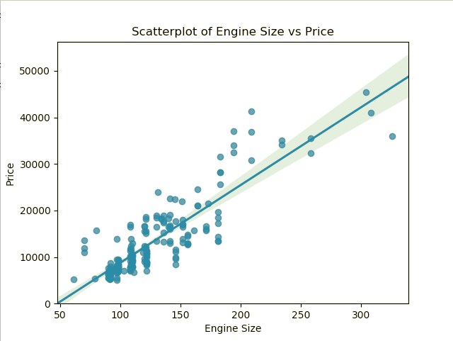
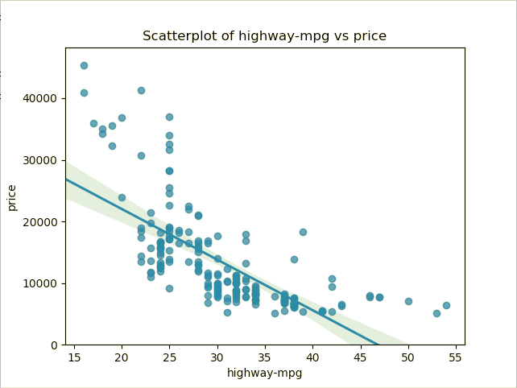
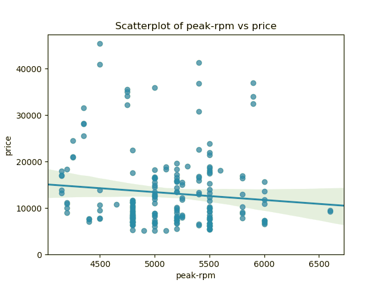
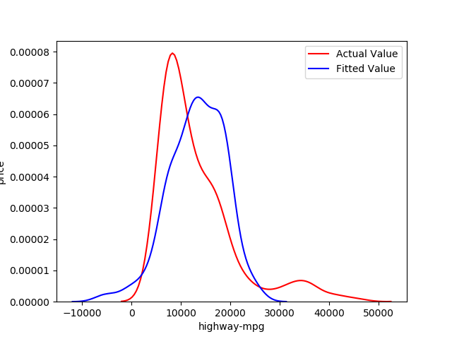
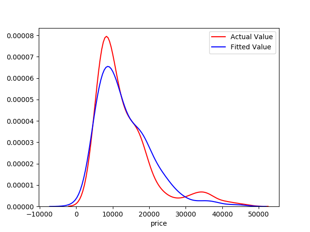

## Data Analysis and Visualisation to predict Car Prices based on Used Car Prices Data Set

In this project I'm trying to analyze and visualize the Used Car Prices from the dataset available at https://archive.ics.uci.edu/ml/machine-learning-databases/autos/imports-85.data in order to predict the most probable car price

It is divided into four parts:

1) Data Wrangling
	- Pre processing data in python
	- Dealing missing values
	- Data formatting
	- Data normalization
	- Binning
	
2) Exploratory Data Analysis
	- Descriptive statistics
	- Groupby
	- Analysis of variance
	- Correlation
	- Correlation stats
	
3) Model Development
	- Simple Linear Regression
	- Multiple Linear Regression
	
4) Model Review and Evaluation
	- Regression Plots
	- Distribution Plots

## Softwares and Libraries Used:

       - Anaconda Distribution
	- Jupyter Notebook
	
	- Numpy
	- Pandas
	- Matplotlib
	- Seaborn
	
## Importing the Modules:

	  import pandas as pd
	  import numpy as np
	  import math
	  import matplotlib.pyplot as plt
	  import seaborn as sns

## Analysis

1) Histograms representing Binned prices in Low, Medium, High

2) Boxplots representing effect of wheel frive with prices.

3) Scatter plot for Prices over Engine size

4) Pivot table categorizing wheel drive and body style with prices.

5) HeatMap with wheel drive in y axis and body style in x axis.

6) Positive Linear Relationship between engine size and price

7) Negetive Linear Relationship between highway-mpg and price

8) Weak Correlation between peak-rpm and price

9) Simple Linear Regression plot

10) Multiple Linear Regression plot

## Conclusion

The distribution plot of Linear Regression and Multiple Regression technique shows how
the model predicts the prices of automobiles based on "horsepower", "curb-weight", "engine-size" and "highway-mpg"

Comparing these three models, we conclude that <b>the MLR model is the best model</b> to be able to predict price from our dataset. This result makes sense, since we have 27 variables in total, and we know that more than one of those variables are potential predictors of the final car price.

